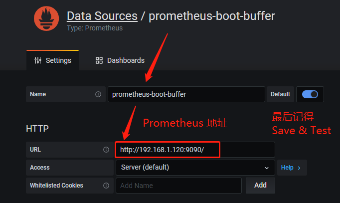
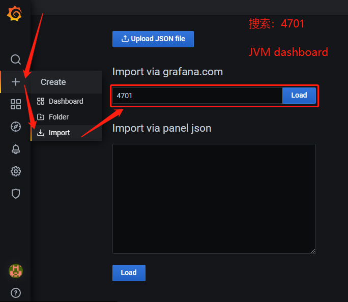
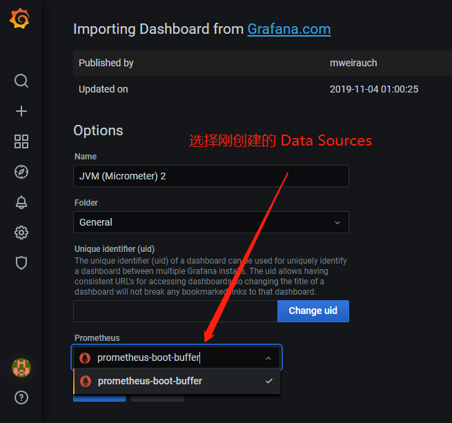
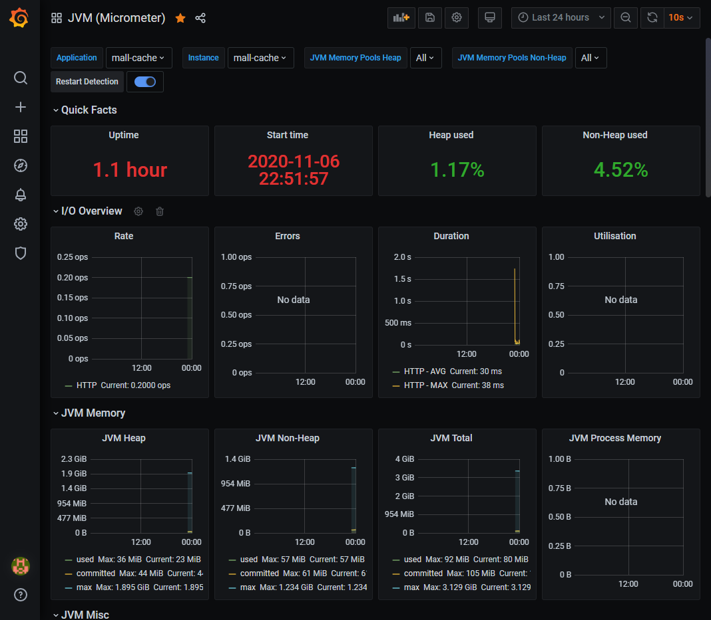

# 集成 Prometheus 监控

## Prometheus
1. Maven依赖

   ```xml
   <dependency>
       <groupId>io.micrometer</groupId>
       <artifactId>micrometer-registry-prometheus</artifactId>
       <scope>runtime</scope>
   </dependency>
   ```

2. application.properties

   ```properties
   # prometheus
   management.endpoints.web.exposure.include=*
   management.endpoint.metrics.enabled=true
   management.endpoint.prometheus.enabled=true
   management.metrics.export.prometheus.enabled=true
   management.metrics.tags.application=${spring.application.name}
   ```

3. 启动 Prometheus
   > [docker-compose.yml](prometheus/docker-compose.yml) 启动 Prometheus

   挂载的外部配置文件如下
   - [prometheus.yml](prometheus/prometheus.yml)
   - [mall-cache.yml](prometheus/config/mall-cache.yml)
   - [mall-product.yml](prometheus/config/mall-product.yml)

4. 测试一下

   [http://192.168.1.120:9090/targets](http://192.168.1.120:9090/targets)

---

## Grafana 配置 JVM 监控
   > [docker-compose.yml](grafana/docker-compose.yml) 启动 Grafana

1. 进入启动后的 Grafana

2. 创建 Data Sources

   

3. 搜索 4701 查找 JVM 监控模板

   

4. 监控模板配置 Data Sources

   

5. 查看监控信息，开始可能展示不全，等会就好了

   
